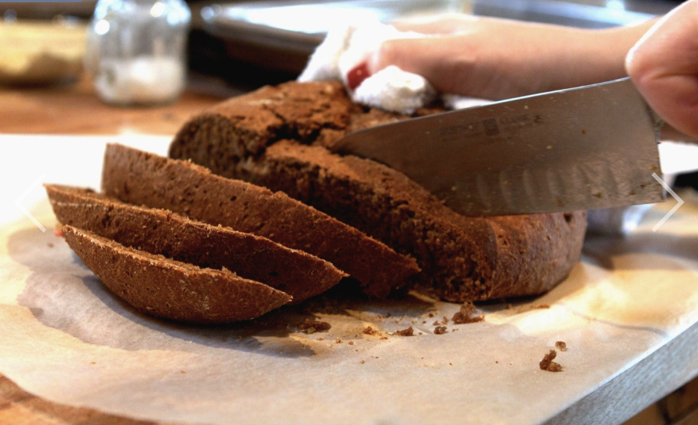

```{r setup, include=FALSE}
knitr::opts_chunk$set(echo = TRUE)
```
##Starwar:


> A famous quote by Kazuda Xiono:

> *"In my mind, that's what I was—Kazuda Xiono, the best starfighter pilot in the galaxy."*

Description | Value
------------|------
Specise     | Human
Gender      | Male
Hair Color  | Black
Eye Color   | Brown

-------------------------------

##Q2:


###Recipe:

* active dry yeast
* sugar
* warm water
* water
* molasses
* apple cider vinegar
* unsalted butter
* unsweetened chocolate
* whole-wheat flour
* medium rye flour
* unbleached, all-purpose or bread flour
* bran
* caraway seeds
* fennel seeds
* salt
* instant espresso powder
* minced shallots
* cornmeal

###Special Equipments:
* grinder
* instant-read thermometer

###Steps:

1. In a small bowl, combine yeast and sugar with warm water. Stir to dissolve and let stand until foamy, about 10 minutes.

2. Heat two cups water, molasses, vinegar, butter and chocolate until the butter and chocolate are melted. Set aside and let cool to lukewarm warm.

3. Combine whole-wheat, rye and white flours in a large bowl. Set aside.

4. In bowl of a heavy mixer fitted with a paddle attachment, combine two cups mixed flours, bran, 2 tablespoons caraway seeds, fennel seeds, salt, espresso and shallots. At low speed, add yeast and chocolate mixtures. Mix until smooth and beat at medium speed for three minutes. (If you don’t like whole seeds in your bread, grinding them in a spice grinder, coffee grinder or mortar and pestle allows their flavor to come through without the texture. I always make my black bread this way.)

[Note: This, or any bread, can also be made by hand, simply mixing the ingredients in a large bowl with a wooden spoon and kneading the dough on a counter until springy and smooth.]

5. At low speed, add half cup of remaining mixed flours at a time, until dough clears sides of bowl and begins to work its way up paddle. It will be very sticky but firm.

6. Scrape dough off paddle, flour counter well, and knead to make a springy yet dense dough. You might not use all of the flour mixture.

7. Form into a ball and place in a greased bowl. Turn once to grease top. Cover with plastic wrap and let rise in a warm area until doubled, about 1 1/2 to 2 hours. Combine cornmeal, flour and remaining caraway seeds, if using, and set aside.

8. Gently deflate dough. Turn out onto a lightly floured surface. Divide into two portions and form into two rounds or loaves. Loaves should be placed in a loaf pan sprayed with nonstick spray, while rounds should be placed seam down on a greased or parchment-lined baking sheet. Sprinkle loaves with cornmeal mixture, if using. Cover loosely with plastic wrap. Let rise until doubled and puffy, about 45 minutes to one hour. Slash an X into the top of a round before baking it; no such slashing is needed for bread in a loaf pan.

9. Bake in a preheated 350°F oven for 45 to 50 minutes or until loaves are well-browned, or register an internal temperature of 200 to 210°F on an instant-read thermometer. Baking time in your oven may vary — check in on the bread when it is 2/3 to 3/4 of the way through the baking time to make sure it has not super-speedily baked. Remove from baking sheet to cool completely on a rack.

No special season nor alternative recipe was mentioned.

------------------------------------

## Definition [edit]

------------------------------------

The **Euclidean Distance** between points **p** and **q** is the length of the line segment connecting them ($\overline{\textbf{pq}}$). In Cartesian coordinates, if **p** = (p1, p2,..., pn) and **q** = (q1, q2,..., qn) are two points in Euclidean n-space, then the distance (d) from **p** to **q**, or from **q** to **p** is given by the Pythagorean formula^1^:
$$d(\textbf{p}, \textbf{q}) = d(\textbf{q}, \textbf{p}) = \sqrt{(q_1 - p_1)^2 + (q_2 - p_2)^2 + ··· + (q_n - p_n)^2} \\= \sqrt{\sum_{i = 1} ^ {n}(q_i - p_i)^2}$$
The position of a point in a Euclidean n-space is a Euclidean vector. So, **p** and **q** may be represented as Euclidean vectors, starting from the origin of the space (initial point) with their tips (terminal points) ending at the two points. The **Euclidean norm**, or **Euclidean length**, or **magnitude** of a vector measures the length of the vector^1^:
$$||\textbf{p}||= \sqrt{p_1^2 + p_2^2 + ··· + p_n^2} = \sqrt{\textbf{p} · \textbf{p}}$$
where the last expression involves the dot product.

-----------------------------------

## Hyperlink

[Google](https://www.google.com)